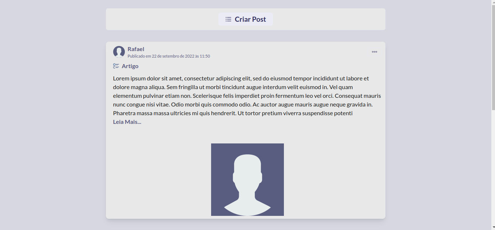
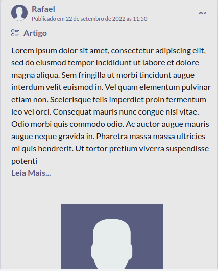
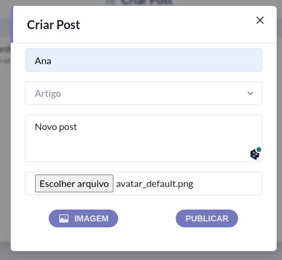
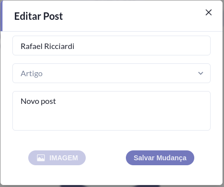
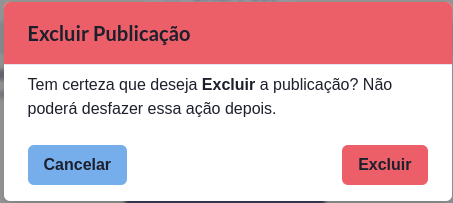
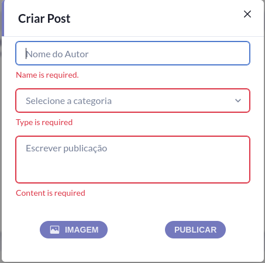

<h1 align="center"><strong>Desafio Técnico LinkLei</strong></h1>

<br/>
<h3 align="center">O desafio proposto consiste em um projeto Fullstack de um feed simulando uma rede social, onde é possível o usuário cadastrar novas publicações, edita e deletar publicações já existentes. </h3>

<br/>
<h3 align="center">
    <a href="#features">Features</a> •
    <a href="#pré-requisitos">Pré-requisitos</a> •
    <a href="#tecnologias">Tecnologias</a> •
    <a href="#autor">Autor</a>
</h3>

## <strong>Features</strong>

<br/>

### <strong>Features da aplicação Backend</strong>

<br/>

- [x] - Criação de uma publicação;<br/>
- [x] - Listagem de todas as publicações cadastradas no banco de dados;<br/>
- [x] - Recupera uma publicação a partir da Id da publicação;<br/>
- [x] - Atualiza uma publicação a partir da Id da publicação;<br/>
- [x] - Exclui uma publicação a partir da Id da publicação;<br/>
    <br/>
    <br/>

### <strong>Features da aplicação Frontend</strong>

<br/>

- [x] - Visualizar publicações no feed;<br/>
- [x] - Modal para novas publicações no header do feed.<br/>
  - [x] - Nome do autor, tipo de publicação e conteúdo da publicação são obrigatório, imagem é opcional e são aceitas apenas imagens nos formatos png e jpg.<br/>
- [x] - Menu de opções no card da publicação;<br/>
  - [x] - Modal para edição da publicação;<br/>
    - [x] - Carrega as informações da publicação a ser editada nos campos do modal;
  - [x] - Modal para excuir a publicação;<br/>
- [x] - Todas as fetures são responsivas para dispositivos mobile
    <br/>
    <br/>
    <br/>
    <br/>

### <strong>Feed Home Page - Desktop</strong>


<br/>
<br/>
<br/>

### <strong>Feed Home Page - Mobile</strong>


<br/>
<br/>
<br/>

### <strong>Criar Post</strong>


<br/>
<br/>
<br/>

### <strong>Edição de Post</strong>


<br/>
<br/>
<br/>

### <strong>Excluir Post</strong>


<br/>
<br/>
<br/>

### <strong>Erros de preenchimento das infos</strong>


<br/>
<br/>
<br/>

## <strong>Pré-requisitos</strong>

Antes de começar você vai precisar ter instalados em sua máquiana as seguintes ferramentas:<br/>

- [x] [Git](https://git-scm.com)<br/>
- [x] [Docker](https://docs.docker.com/get-docker/)<br/>
- [x] [Docker Compose](https://docs.docker.com/compose/gettingstarted/)<br/>
- [x] [yarn](https://classic.yarnpkg.com/lang/en/docs/install/#debian-stable)<br/>

Além disto é bom ter um editor para trabalhar com o código como [VSCode](https://code.visualstudio.com/)

<strong>Antes de iniciar a aplicação seguindo o passo a passo a diante, você deve renomear o arquivo .env.example para .env no diretório server</strong>

### <strong>Como rodar a aplicação</strong>

```bash
# Clone este repositório
$ git clone git@github.com:ricciardi305/teste-linklei.git

# entre na raiz do projeto clonado
$ cd teste-linklei

# Gere o container no docker (se você ainda não tiver as imagens do node e postgres, o docker pode demorar um pouco para inicializar)
$ sudo docker compose up --build

# Em outra guia do terminal acesse o diretório do front-end
$ cd feed

# instale as dependências
$ yarn install

# inicie a aplicação
$ yarn dev

# Pronto! A aplicação está rodando nas portas:
# Backend -> 3001
# Banco de dados -> 5432
# Frontend -> 5173, o Vite pode variar as portas, cheque no terminal.
```

<br/><br/>

## <strong>Tecnologias</strong>

<br/>

### <strong>Principais tecnologias utilizadas - Backend</strong>

<br/>

- [x] [Node](https://nodejs.org/pt-br/)<br/>
- [x] [TypeScript](https://www.typescriptlang.org/)<br/>
- [x] [Postgres](https://www.postgresql.org/)<br/>
- [x] [TypeORM](https://typeorm.io/)<br/>

Para mais detalhes dessas e outras tecnologias utilizadas no backend [package.json](server/package.json)

### <strong>Principais tecnologias utilizadas - Frontend</strong>

<br/>

- [x] [React](https://pt-br.reactjs.org/)<br/>
- [x] [Vite](https://vitejs.dev/)<br/>
- [x] [ChakraUI](https://chakra-ui.com/)<br/>
- [x] [Axios](https://axios-http.com/ptbr/)<br/>
- [x] [React-hook-form](https://react-hook-form.com/)<br/>

Para mais detalhes dessas e outras tecnologias utilizadas no frontend [package.json](feed/package.json)

<br/>

<strong>ENDPOINTS BACKEND:</strong> Na raiz desse projeto existe um arquivo [insomnia.json](insomnia.json), nele encontra-se todos os endpoints da aplicação e exmplos de requisições e respostas.
<br/>
<br/>

# Licença

Este projeto está sob a licença MIT License - Veja o arquivo [License](LICENSE) para mais detalhes.
<br/>
<br/>

# Autor

<br/>

<a href="https://github.com/ricciardi305">
    
    <br />
    <sub style="font-size: 16px"><b>Rafael Ricciardi</b></sub>
</a>

<br/>

> Feito com ❤️ por Rafael Ricciardi 👋🏽 Entre em contato!

[](https://www.linkedin.com/in/rafaelricciardi/)
[](mailto:ricciardi.rafael1997@gmail.com)
[](https://github.com/ricciardi305)
